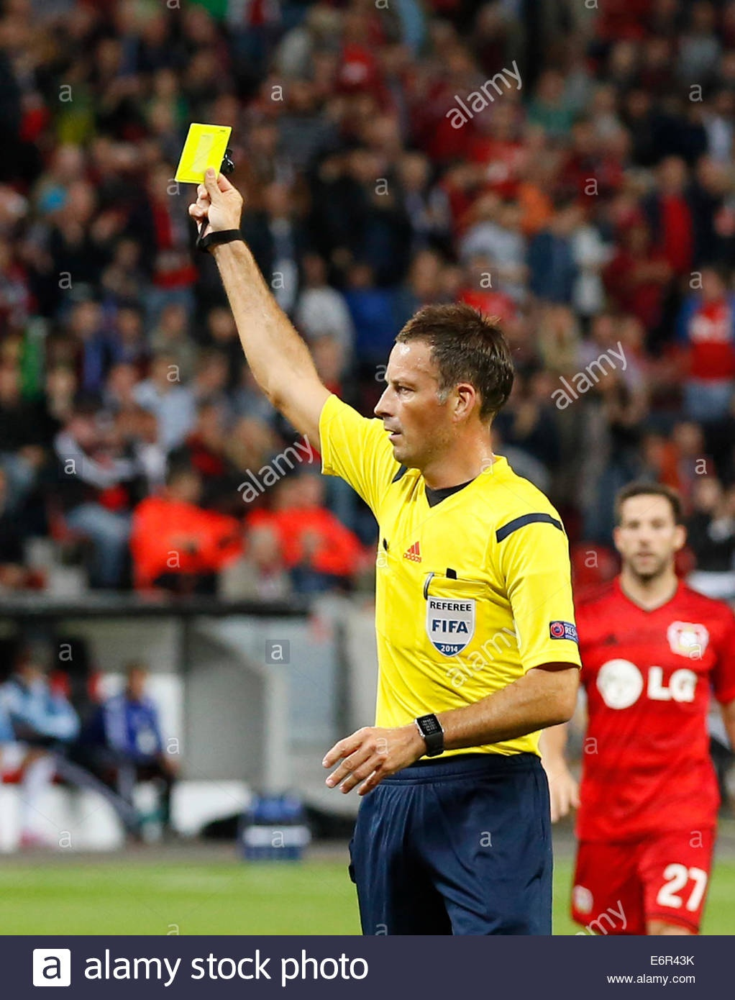
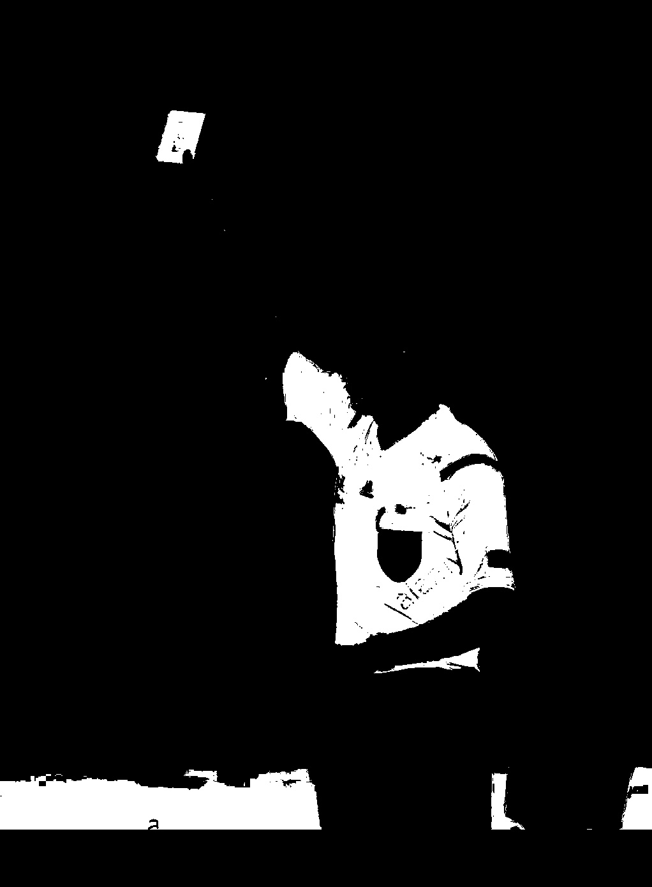
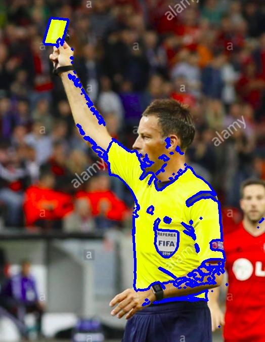
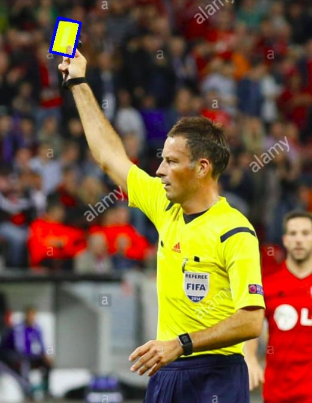

# Card Detection

This package contains scripts to detect yellow and red card occurrences in soccer. We accomplish this by using traditional color filtering and contour processing.

### Here are the steps that we used:
  1. Convert the RGB image to HSV. We do this because the HSV color space seperates the "color" of the image from its "brightness", and as a result, is so much more useful for color processing.
  
      See this [link](http://infohost.nmt.edu/tcc/help/pubs/colortheory/web/hsv.html) for info about the HSV color space. Also [note](https://stackoverflow.com/a/10951189) that OpenCV may have different HSV scales than other libraries.
  2. Convert the HSV image to a single channel image. We do this by specifying a lower and upper HSV bound for the color we want to detect. Anything outside of this bound is 0, while everything inside the bound is 255. This way, we filter out everything that is not the correct color for the object we are looking for.
  
      Here, we [set](https://github.com/CS196Illinois/Event_Detection/blob/master/card-detection/detect.py#L90) the HSV bounds for yellow, and you can see the result.
      
      |
  3. Afterwards, we find all the [contours](https://docs.opencv.org/3.4/d3/d05/tutorial_py_table_of_contents_contours.html) in the filtered image. Here is a picture of the above image with the contours drawn on it.
      
      |
  
  4. Then, we [filter](https://github.com/CS196Illinois/Event_Detection/blob/master/card-detection/detect.py#L68) the contours, only looking for ones that could potentially be a soccer card. We first filter out all contours that are within another contour. Then, we check the area of the contour, the aspect ratio of the contour, the solidity of the contour, and some other filters. Many of the parameters for these were empirically tuned.
  
      Here are two images: one with all the contours, one after all the filters have been run.
  
      |

### Libraries used:
  - OpenCV
  - Numpy
