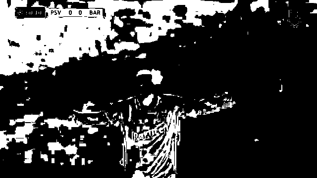
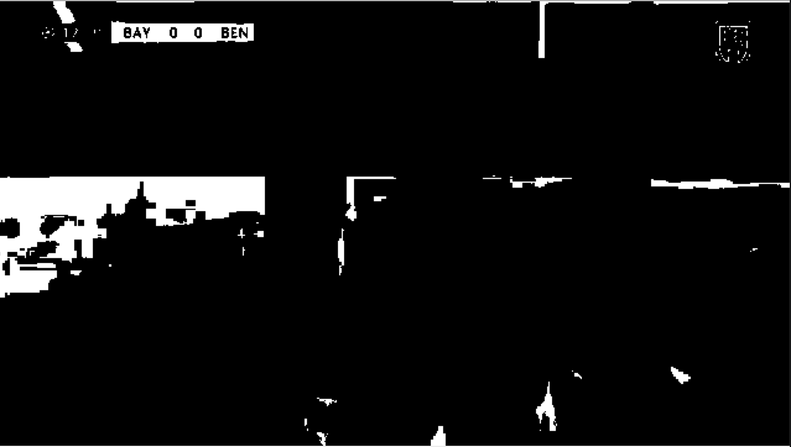
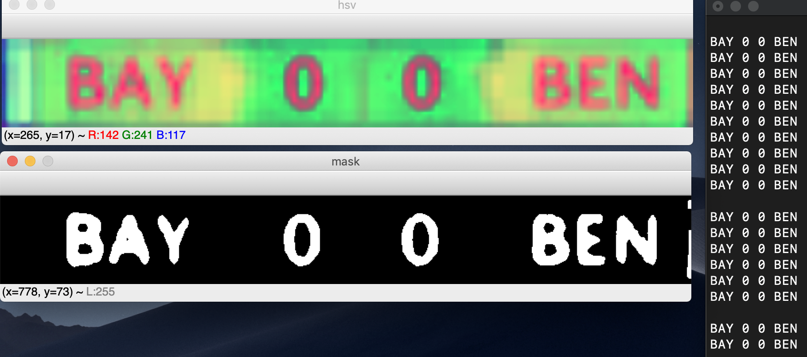

# Score Detection

This package contains scripts to detect goals scored in soccer. We accomplish this by using traditional color filtering, region detection, and optical character recognition.

### Here are the steps that we used:
  1. Go through an initial video frame pixel by pixel and filter out any pixels in the first frame that have too much green. This serves to instantly eliminate all the grass and much of the audience and players.
  
      |
  
  2. Go through the video frame by frame and eliminate the pixels that change as the video progresses. At the end only pixels that have remained relatively the same will remain (i.e. the scoreboard).
  
      |
  
  3. Afterwards, we expand the scoreboard and use pytesseract to convert the image to a string. Then, we do some filtering to remove noisy characters from the string, to figure out the current score and when it changes.
  
      

### Libraries used:
  - OpenCV
  - Numpy
  - Pytesseract

### Resources used:
  - [Research Paper](http://www.iaiai.org/journals/index.php/IEE/article/download/187/100)
